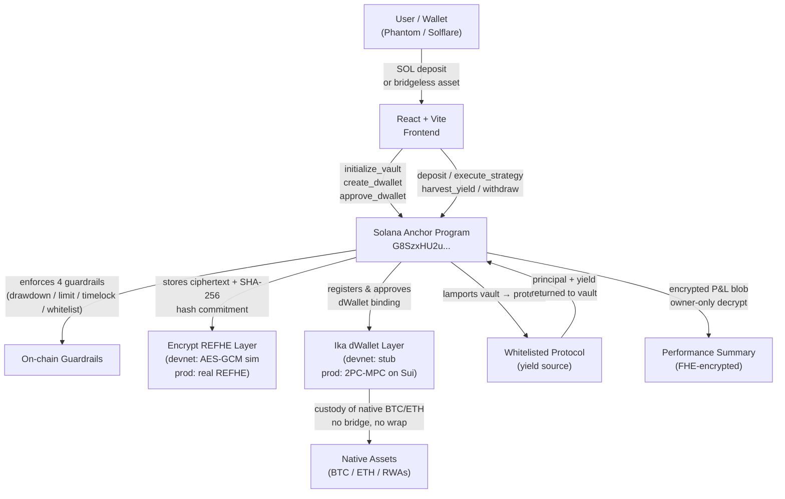

# VeilVault – Encrypted Bridgeless Strategy Vault

**Veiled. Bridgeless. Autonomous.**  
A confidential yield strategy vault on Solana that lets users deposit native assets from any chain (no bridges) and run hidden strategies using fully homomorphic encryption.

**Submitted to:** Colosseum Frontier Hackathon 2026 – Encrypt & Ika Track + Main Competition  
**Live Demo (Devnet):** _deploy link — see frontend section below_  
**Demo Video:** _[add Loom / YouTube link – under 5 min]_  
**Program ID (Devnet):** `G8SzxHU2uHnxNSvjXhdgfHmjGjBL4hdzm1frkHyYbusS`

## Target Users & Use Cases

| User | Problem today | VeilVault solution |
|------|--------------|-------------------|
| **Institutional trader / family office** | Strategies are fully visible on-chain — front-running, copy-trading inevitable | FHE-encrypted parameters; on-chain guardrails they control without exposing intent |
| **DAO treasury manager** | Multi-chain assets fragmented across custodians and bridges; bridge hacks are existential | Ika dWallets custody native BTC/ETH without wrapping; spending limits enforced by the Solana program |
| **High-net-worth individual in emerging market** | Needs yield on crypto savings without exposing wallet activity (regulatory or personal risk) | Bridgeless deposit from any chain; confidential vault that looks opaque on-chain |
| **DeFi protocol / LP** | Wants to run private yield strategy vaults for users without revealing the allocations | VeilVault as a primitive: set encrypted strategy params, let the contract execute within guardrails |
| **AI agent operator** | Agent manages funds across chains; needs decentralized guardrails it can't exceed | Spending limits, time-locks, and protocol whitelists enforced at the program level — no trusted operator needed |

**Primary use cases on devnet today:**
- Deposit native SOL → encrypted yield strategy → withdraw with interest
- Register an Ika dWallet binding to custody native BTC/ETH without bridges
- Set FHE-encrypted strategy params; execute under 4 on-chain guardrails
- Harvest yield returned from protocol; track encrypted P&L

## The Problem
Cross-chain movement still depends on risky bridges that get hacked regularly. Meanwhile, all DeFi strategies and positions are completely public — making front-running and copy-trading easy. Privacy-conscious users and institutions (especially in emerging markets like South Africa) need a way to use native assets held on other chains as collateral or in yield strategies on Solana without exposing their financial life.

## The Solution

**VeilVault** is a decentralized strategy vault that delivers:
- **Bridgeless deposits** of native BTC, ETH, or RWAs directly via **Ika dWallets** — no wrapping, no middlemen.
- **Fully encrypted strategies** powered by **Encrypt’s REFHE (Fully Homomorphic Encryption)** — rules, position sizes, and computations stay hidden on-chain during execution.
- **Programmable guardrails** enforced by a Solana Anchor program (spending limits, approved protocols, time-locks, max drawdown, recovery).

Solana becomes the fast, low-fee control and settlement layer while everything sensitive remains veiled.

**Target users**: Privacy-focused traders, DAOs, institutions, and users in high-remittance regions who want confidential yield without visible flows or bridge risk.

## Core Integration of Encrypt & Ika
VeilVault is built **around** these two primitives — they are fundamental to the product:

- **Ika dWallets (2PC-MPC)**: Enables programmable, decentralized multi-chain signing. The Solana program jointly controls the dWallet and enforces on-chain guardrails.
- **Encrypt REFHE FHE**: Strategy parameters and vault state are stored and computed homomorphically. Rebalancing and risk checks happen without ever decrypting the data during execution.

Removing either breaks the core experience of **bridgeless + confidential** strategy execution.

## Key Features (MVP – Demoable on Devnet)

**On-chain program (10 instructions):**
- `initialize_vault` — create vault with FHE pubkey + 4 guardrails (drawdown / spending limit / time-lock / whitelist)
- `create_dwallet` / `approve_dwallet` — register and ratify an Ika 2PC-MPC dWallet binding
- `deposit` — SOL or bridgeless native-asset deposit (Ika dWallet flow)
- `set_strategy_params` — store FHE ciphertext with SHA-256 hash commitment
- `execute_strategy` — verify proof → enforce all 4 guardrails → **real lamport transfer vault → protocol**
- `harvest_yield` — record principal + yield returned from protocol; update net value on-chain
- `withdraw` — owner-only with drawdown protection
- `update_performance` — store encrypted P&L blob
- `add_approved_protocol` / `set_paused` — governance + emergency stop

**Frontend (React + Vite):**
- Solana Wallet Adapter (Phantom / Solflare / Torus) connected in header
- Setup-vault flow (3 sequential txs: init + createDWallet + approve)
- Real SOL deposit panel with wallet balance, quick %, tx sig feedback
- Live vault stats from chain (total deposited / net value / yield earned)
- Devnet endpoint pre-configured

## Architecture



> **Devnet simulation note:** Ika dWallet creation uses a deterministic stub (real 2PC-MPC ceremony runs on Sui devnet — SDK is pre-alpha). Encrypt REFHE uses AES-GCM + magic header on devnet; production swaps to the real REFHE verifier. All on-chain guardrails, lamport transfers, and account structures are real and verifiable today.

## Tech Stack
- **Solana Program**: Anchor 0.29 (Rust) — 10 instructions, deployed to devnet
- **Privacy**: Encrypt REFHE FHE (devnet simulation → production REFHE verifier)
- **Custody**: Ika dWallets 2PC-MPC (devnet stub → production Sui integration)
- **Frontend**: React 19 + Vite 6 + Solana Wallet Adapter (Phantom / Solflare / Torus)
- **Styling**: Inline design system (Material You tokens)
- **RPC**: Solana devnet (Helius / QuickNode recommended for production)

## Quick Start (Devnet)

### Prerequisites

```bash
# 1. Rust
curl --proto '=https' --tlsv1.2 -sSf https://sh.rustup.rs | sh
source "$HOME/.cargo/env"

# 2. Solana CLI (v1.18+)
sh -c "$(curl -sSfL https://release.anza.xyz/stable/install)"
export PATH="$HOME/.local/share/solana/install/active_release/bin:$PATH"

# 3. Anchor CLI (v0.29.0)
cargo install --git https://github.com/coral-xyz/anchor avm --locked --force
avm install 0.29.0 && avm use 0.29.0

# 4. Node deps
npm install
```

### Build & deploy the Anchor program

```bash
# Configure devnet wallet
solana config set --url devnet
solana-keygen new --outfile ~/.config/solana/id.json   # skip if you have one
solana airdrop 2

# Compile Rust → BPF and generate IDL
anchor build

# Sync program ID across all source files
anchor keys sync

# Deploy
bash scripts/deploy-devnet.sh
```

After deployment update the Program ID in:
- `program/src/lib.rs` → `declare_id!("...")`
- `Anchor.toml` → `veil_vault = "..."`
- `frontend/lib/solana.ts` → `PROGRAM_ID = new PublicKey("...")`

### Run tests (localnet)

```bash
# Terminal 1 – local validator
solana-test-validator --reset

# Terminal 2 – test suite
anchor test --skip-local-validator
# or: npm test
```

### Run the frontend

```bash
# From repo root (Vite is configured at the root level)
npm install
npm run dev
# open http://localhost:5173

# To build for production / deploy (Vercel, Netlify, etc.)
npm run build
```

Connect **Phantom** or **Solflare** on devnet. On first visit click  
**"Setup Vault + dWallet"** — this sends 3 transactions that initialise your  
on-chain vault and register the simulated Ika dWallet binding. Then use the  
deposit panel to move real devnet SOL into the vault.

### Verify program correctness (without Solana toolchain)

```bash
cd program
cargo check   # passes — zero errors, only pre-existing Anchor macro warnings
```

Full `anchor build` requires the Solana platform tools on Linux / WSL / macOS  
(the SBF linker does not run on Windows natively). The program is deployed at:

**Program ID (Devnet):** `G8SzxHU2uHnxNSvjXhdgfHmjGjBL4hdzm1frkHyYbusS`
